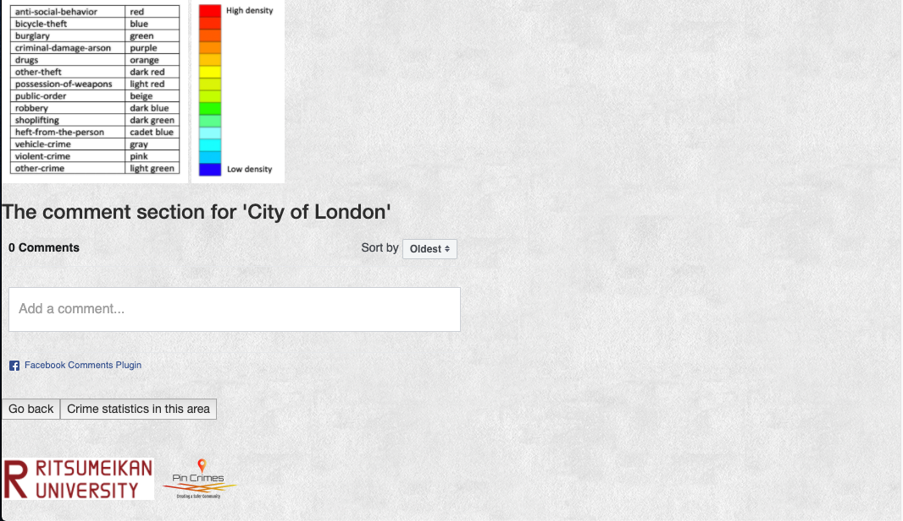

# Pin Crimes

Pin Crimes is a Flask web application which users can pick a place by searching and check the crime rates with 14 categories around one miles in a month in UK. The map also shows the heatmap of the crime so that users can 
see the distribution of it. The crime data is from Police API from UK police (https://data.police.uk/).

## Features

## Authors

* **Lee Jui Chi**: App developer, Backend Developer
* **Cho I An**: Frontend Developer

